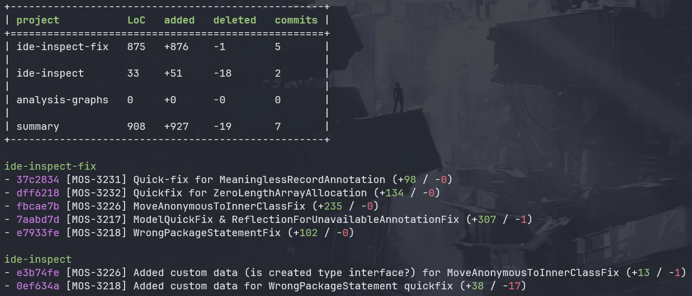
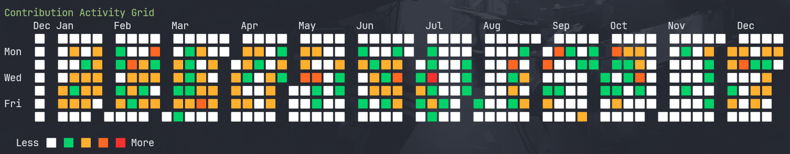

# ***Con***tribution ***Sta***tistics
CLI tool to get git contribution statistics for multiple repos.




## Usage
### If you have cargo installed:
```bash
cargo run "C:\projects\ide-inspect-fix" "C:\projects\ide-inspect" "C:\updated\analysis-graphs" --author "00642383" --since "2025-12-20" --until "2025-12-29
" --breakdown
```
### If you don't have cargo installed, use release for your platform from https://github.com/GingerYouth/consta/releases/tag/v0.1.0

## CLI arguments:
* *author* \<string>
* *since* \<date>
* *until* \<date>
* *breakdown*