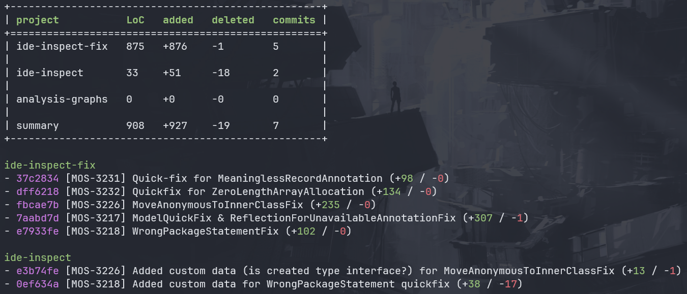
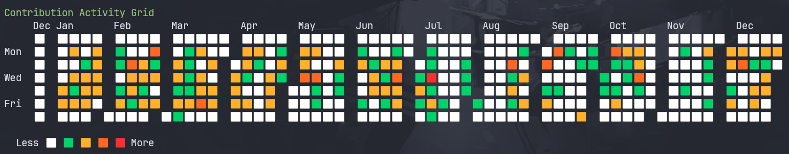

# ***Con***tribution ***Sta***tistics
CLI tool to get git contribution statistics for multiple repos. The project was born from the desire to track this stats for non-github/gitlab projects.




## Usage
* Recommended to run from Git Bash (to avoid incorrect display of grid symbols).
### If you have cargo (recommended):
1) Install via:
```
cargo install consta
```
2) Run by passing repos (or dirs with repos with `--recursive`), author and optional arguments, for example:
```bash
consta "C:\projects\" --author "00642383" --since "2026-01-01" --breakdown --recursive
```
### If you don't have cargo:
1) Download the latest release for your platform from [releases page](https://github.com/GingerYouth/consta/releases/latest)

2) Run executable as you would do in your OS, e.g.: `consta.exe <args>` on Windows


## CLI arguments:
* *author* \<string>     : Filter commits by author name or email
* *since* \<date>        : Show commits after this date (e.g. 2026-01-01)
* *until* \<date>        : Show commits before this date
* *breakdown*            : Show commit breakdown
* *grid* \<year>         : Show activity grid for a specific year
* *recursive* \[<depth>] : Discover repos in subdirectories (default depth = 3)
